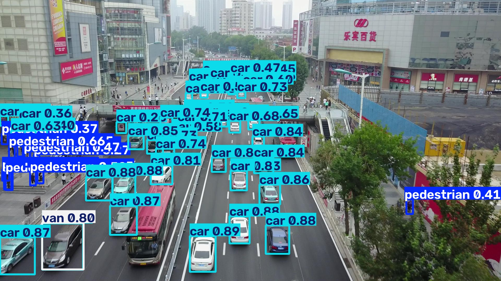
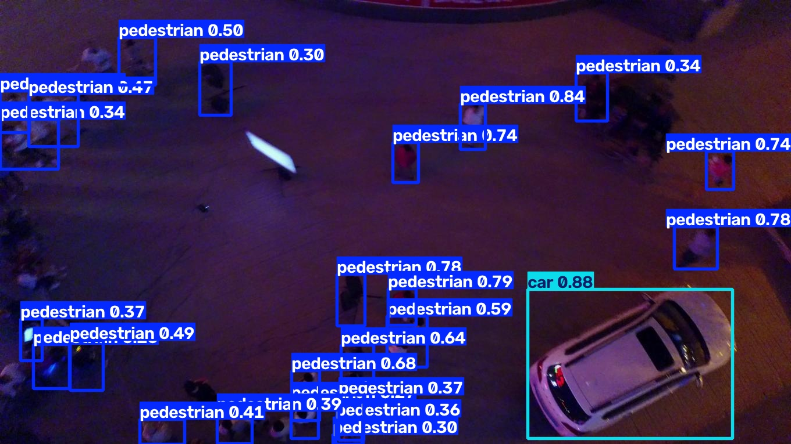

# Aerial_Tracking

**Detect and track pedestrians and vehicles from UAV aerial footage — optimized for small objects, high scene density, and edge deployment.**

---

## Demo

<!-- TODO: Replace with an embedded GIF once exported from tracked output video -->
<!-- Suggested source: outputs/tracked/tracked_output_1.mp4 -->


> **Placeholder:** Add a GIF here (recommended: 640 px wide, ~10 s loop from `outputs/tracked/tracked_output_*.mp4`).

---

## Problem Statement

Aerial object detection identifies and localizes objects in images or video captured from an unmanned aerial vehicle (UAV), typically at oblique or nadir viewpoints hundreds of meters above the ground. It is substantially harder than generic object detection: targets occupy only a few pixels (small object scale), scenes contain dozens or hundreds of instances (high density), the camera platform moves (motion blur and shifting background), and appearance varies with altitude, angle, and lighting.

These constraints matter directly for aerospace and UAV applications — runway and landing-zone monitoring, perimeter surveillance, traffic flow analysis, and infrastructure inspection all depend on reliable perception from a moving aerial platform, often with strict latency and power budgets onboard.

---

## Approach

### Dataset
- **VisDrone2019-DET** — 2,000-image subset (`data/VisDrone2019-DET-train/`), split 80 / 19.8 / 1 % into **1,584 train / 396 val / 20 test** (`src/split_dataset.py`).
- **VisDrone-MOT** — sequence subset for tracking evaluation (`data/MOT-subset/sequences/`).
- **Classes kept:** pedestrian, car, van, truck — the primary road-traffic actors for UAV surveillance.
- **Classes dropped:** people, bicycle, tricycle, awning-tricycle, bus, motor, others — rare, heavily overlapping, or weakly represented at aerial scale; dropping them reduces label noise and class imbalance while keeping the task focused on traffic monitoring.

### Detection
- **Model:** YOLOv8n (nano) — swap to `yolov8s.pt` in `src/train.py` if GPU memory allows.
- **Input size:** 512 px (configurable via `imgsz` in `src/train.py`).
- **Transfer learning:** COCO-pretrained weights (`models/yolov8n.pt`).
- **Training:** 100 epochs, batch 16, early stopping (`patience=15`), seed 42.

### Tracking
- **Algorithm:** SORT — Kalman-filter motion prediction + IOU cost matrix + Hungarian assignment (`src/track.py`).
- **Why SORT over DeepSORT:** No appearance embedding network → lower compute and memory, suitable for edge deployment. Aerial scenes often have moderate occlusion and spatial separation between instances, where motion-based association is sufficient for a baseline.

### Deployment
- **Export:** ONNX (FP32 and INT8 quantization) via `src/export_benchmark.py` *(planned — script stub present)*.
- **Benchmarks:** Side-by-side latency, FPS, and model-size comparison across PyTorch FP32, ONNX FP32, and ONNX INT8 runtimes.

---

## Results

### Detection metrics

Best checkpoint from run `visdrone_baseline-6` (validation set, epoch 88 — highest mAP@0.5:0.95):

| Metric | Value |
|---|---|
| mAP@0.5 | 0.323 |
| mAP@0.5:0.95 | 0.178 |
| Precision | 0.467 |
| Recall | 0.343 |

<!-- TODO: Run `python tests/predict_test.py` and fill in held-out test-set numbers -->
| **Test set (held-out)** | *TBD — run `python tests/predict_test.py`* |

### Deployment benchmarks

<!-- TODO: Fill after running src/export_benchmark.py -->

| Config | Latency (ms) | FPS | Model size (MB) |
|---|---|---|---|
| PyTorch FP32 | *TBD* | *TBD* | *TBD* |
| ONNX FP32 | *TBD* | *TBD* | *TBD* |
| ONNX INT8 | *TBD* | *TBD* | *TBD* |

**Test hardware:** *[TBD — e.g. NVIDIA RTX 3060 Laptop, Intel i7, 16 GB RAM]*  
All numbers above are from a development workstation. They do **not** represent onboard flight-hardware performance.

---

## Sample Outputs

### Detection — success case

<!-- TODO: Replace with a strong test-set prediction -->


> **Placeholder:** Good detection on dense traffic — e.g. from `outputs/test_inference/` or `outputs/runs/visdrone_baseline-6/val_batch0_pred.jpg`.

### Detection — failure case

<!-- TODO: Replace with a documented miss or false positive -->


> **Placeholder:** Document a known failure mode — e.g. missed small distant vehicle, or false positive on shadow/road marking.

### Tracking — qualitative summary

<!-- TODO: Fill after reviewing tracked output -->

> **Placeholder:** *N* unique tracks maintained across *M* frames; *X* ID switches observed.  
> Source videos: `outputs/tracked/tracked_output_1.mp4`, `tracked_output_2.mp4`, `tracked_output_3.mp4`.


---

## Aerospace / Real-World Relevance

This pipeline maps directly to UAV-based situational awareness: persistent surveillance over runways and landing zones, monitoring vehicle and pedestrian activity around airports or bases, and automated infrastructure inspection where a moving aerial platform must detect small objects in real time. The edge-deployment focus (YOLOv8n + ONNX) reflects the compute and power constraints of actual onboard flight hardware.

---

## Limitations & Next Steps

| Area | Planned improvement |
|---|---|
| Class coverage | Expand beyond 4 classes (bus, bicycle, motor) |
| Tracking robustness | DeepSORT or ByteTrack for heavy occlusion |
| Sensors | Multi-camera / multi-drone fusion |
| Validation | Real onboard hardware benchmarking (Jetson, flight computer) |
| Export | Complete `src/export_benchmark.py` with INT8 quantization pipeline |

These are roadmap items, not blockers — the current baseline establishes a reproducible end-to-end path from VisDrone data to tracked aerial video.

---

## Repo Structure

```
Obj_Detection_and_Tracking/
├── data/
│   ├── visdrone.yaml                  # YOLO dataset config (paths + class names)
│   ├── subset_list.txt                # 2000-image DET subset manifest
│   ├── VisDrone2019-DET-train/        # Raw DET subset (images + annotations)
│   ├── VisDrone2019-DET-split/        # Train / val / test split
│   │   ├── train/
│   │   ├── val/
│   │   └── test/
│   ├── yolo/                          # YOLO-format images + labels
│   │   ├── images/{train,val,test}/
│   │   └── labels/{train,val,test}/
│   ├── MOT-subset/                    # VisDrone-MOT sequences for tracking
│   │   └── sequences/
│   └── DET-subset/
├── models/
│   └── yolov8n.pt                     # COCO-pretrained checkpoint
├── src/
│   ├── split_dataset.py               # 80/19.8/1 split of DET subset
│   ├── data_prep.py                   # VisDrone annotations → YOLO format
│   ├── train.py                       # YOLOv8 fine-tuning
│   ├── track.py                       # SORT tracker on MOT sequences
│   └── export_benchmark.py            # ONNX export + latency benchmarks (stub)
├── tests/
│   ├── sanity_check.py                # Visualize random training labels
│   └── predict_test.py                # Test-set metrics + inference
├── outputs/                           # Generated artifacts (gitignored)
│   ├── runs/visdrone_baseline-6/      # Weights, curves, batch previews
│   ├── sanity_check/
│   ├── test_inference/
│   └── tracked/
├── requirements.txt
├── pyproject.toml
└── README.md
```

> **Note:** `data/` and `outputs/` are gitignored. Download VisDrone data separately (see Setup).

---

## Setup / Reproduce

### 1. Environment

```bash
python3 -m venv venv && source venv/bin/activate
python -m pip install -r requirements.txt
```

### 2. Data

Download [VisDrone2019](https://github.com/VisDrone/VisDrone-Dataset) and place subsets under `data/` as shown in the repo structure above. The 2,000-image DET subset is listed in `data/subset_list.txt`.

### 3. Data preparation

```bash
# Split 2000 images → train (1584) / val (396) / test (20)
python src/split_dataset.py

# Convert VisDrone bbox annotations → YOLO format (4 classes)
python src/data_prep.py

# Optional: verify labels visually
python tests/sanity_check.py
```

### 4. Train detector

```bash
python src/train.py
```

Weights saved to `outputs/runs/visdrone_baseline-6/weights/best.pt`.

### 5. Evaluate on test set

```bash
python tests/predict_test.py
```

### 6. Run tracking (SORT)

Edit the three paths at the top of `src/track.py` (`SEQ_DIR`, `MODEL_PATH`, `OUTPUT_PATH`), then:

```bash
python src/track.py
```

### 7. Export & benchmark *(planned)*

```bash
# Stub — implement in src/export_benchmark.py
python src/export_benchmark.py
```

Or export manually with Ultralytics:

```bash
python -c "from ultralytics import YOLO; YOLO('outputs/runs/visdrone_baseline-6/weights/best.pt').export(format='onnx')"
```

---

## License

VisDrone dataset — see [VisDrone-Dataset](https://github.com/VisDrone/VisDrone-Dataset) for terms of use.  
YOLOv8 — [AGPL-3.0](https://github.com/ultralytics/ultralytics/blob/main/LICENSE).
